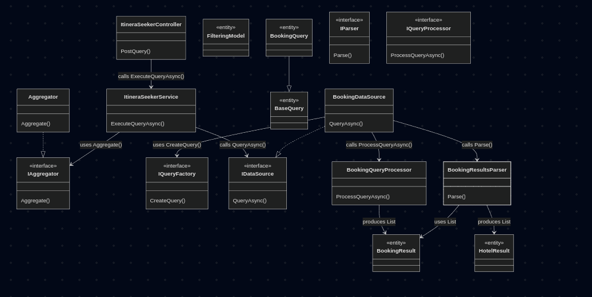

# ItineraSeeker

**ItineraSeeker** is a data querying service for the **Itinera** app, designed to retrieve and aggregate travel-related data (e.g., hotels, places) from multiple sources based on user input such as budget, destination, and description. It follows **Clean Architecture** principles to ensure maintainability, testability, and extensibility, with a focus on separation of concerns and dependency inversion.

## Project Structure

The project is organized into four main layers:

- **Domain**: Contains entities (e.g., `FilteringModel`, `HotelResult`), interfaces (e.g., `IDataSource`, `IQueryProcessor`, `IParser`), and business logic that are independent of any framework or external system.
- **Application**: Defines application-specific use cases and orchestrates the flow of data between the Domain and Infrastructure layers. Key components include `ItineraSeekerService`, `QueryFactory`, and `Aggregator`.
- **Infrastructure**: Handles interactions with external systems like databases, APIs, or file systems. It includes implementations of `IDataSource` (e.g., `BookingDataSource`), `IQueryProcessor`, and `IParser`.
- **Presentation**: Manages the API layer using ASP.NET Core, exposing endpoints (e.g., `ItineraSeekerController`) to handle HTTP requests and responses.

## How It Works

The system processes user queries as follows:

1. **Client Request**: The client sends a `FilteringModel` to the **Presentation Layer** via an HTTP POST request. Here's an example of a FilteringModel

2. **Service Orchestration**: The **ItineraSeekerService** in the **Application Layer** receives the `FilteringModel` and uses a list of `IDataSource` implementations (e.g., `BookingDataSource`) to fetch data from various sources in parallel.
3. **Data Source Querying**: Each `IDataSource`:
   - Uses an `IQueryFactory` to create a specific query (e.g., `BookingQuery`).
   - Calls an `IQueryProcessor` (e.g., `BookingQueryProcessor`) to fetch raw data (e.g., `List<BookingResult>`).
   - Uses an `IParser` (e.g., `BookingResultsParser`) to convert the raw data into a standardized `List<HotelResult>`.
4. **Result Aggregation**: The **Aggregator** combines the results from all data sources into a single list, which is returned to the client.

## Dependencies and Setup

This project requires **.NET 8.0** or later. The following NuGet packages are used:

- `Microsoft.AspNetCore.App`
- `Microsoft.Extensions.DependencyInjection`

To set up the project:

1. Clone the repository.
2. Restore the NuGet packages using `dotnet restore`.
3. Configure any necessary API keys or connection strings in the `appsettings.json` file (e.g., for external APIs like Google Places).

## Running the Project

To run the project:

1. Build the solution using `dotnet build`.
2. Run the Presentation project using `dotnet run --project Presentation`.
3. Send a POST request to `http://localhost:<port>/api/ItineraSeeker` with a JSON body containing the `FilteringModel`.

Example request body:

```json
{
  "destination": {
    "city": "Paris",
    "country": "France"
  },
  "checkIn": "2025-06-01T15:00:00.000Z",
  "checkOut": "2025-06-07T11:00:00.000Z",
  "travelers": {
    "adults": 2,
    "children": 1
  },
  "accommodation": {
    "rooms": 1,
    "roomTypes": [
      "double",
      "child-friendly"
    ]
  },
  "budget": {
    "min": 500,
    "max": 2000
  },
  "userCurrency": "EUR",
  "userCountry": "DE",
  "userLanguage": "de"
}
```

The response will be a list of `HotelResult` objects aggregated from all configured data sources.

## Extending the Project

To add a new data source (e.g., for a different travel API or database):

1. **Implement `IDataSource`**:

   - Create a new folder in the **Infrastructure** layer (e.g., `Data/NewDataSource`) and a new class that implements `IDataSource` (e.g., `Data/NewDataSource/NewDataSource.cs`).
   - Inject the necessary `IQueryFactory`, `IQueryProcessor`, and `IParser` for the new source.
   - Implement the `QueryAsync` method to create the query, fetch raw data, and parse it into `List<HotelResult>`.

2. **Register in DI**:

   - Update the `AddInfrastructure` method in the **Infrastructure** layer to register the new `IDataSource` implementation.
   - For example:
     ```csharp
     services.AddSingleton<IDataSource, NewDataSource>();
     ```

3. **Update Aggregator (if needed)**:
   - If the new data source requires special handling in aggregation (e.g., deduplication), update the `Aggregator` logic accordingly.

## Architecture Diagram

For a visual representation of the architecture, refer to this diagram.


##  TODO

* [ ] Add more data source integrations (e.g., Places API)
* [ ] Implement caching for repeated queries

